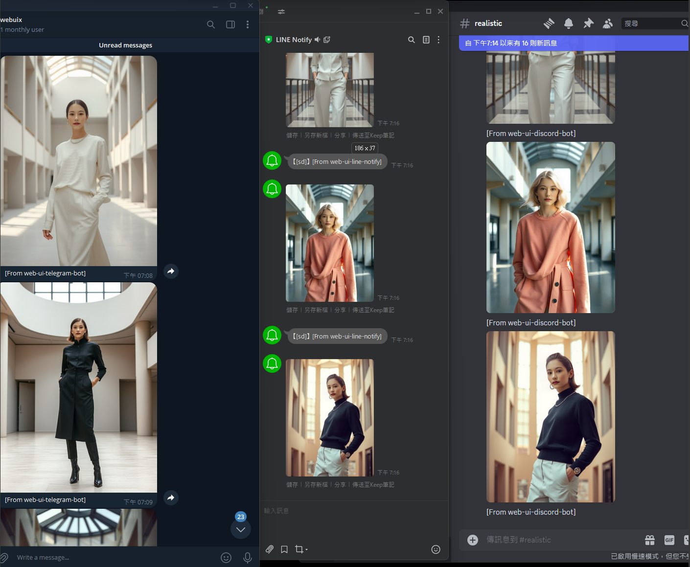
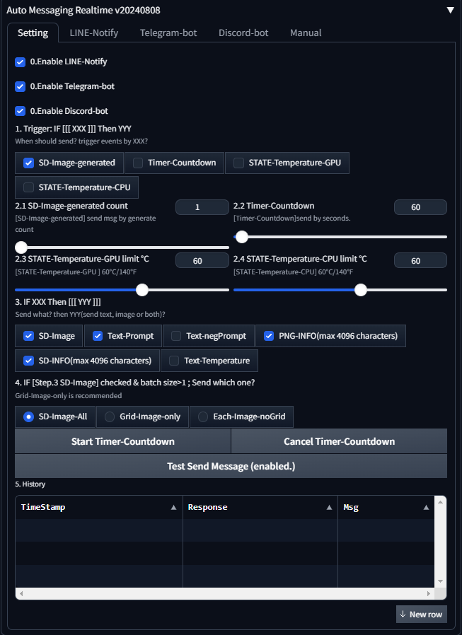
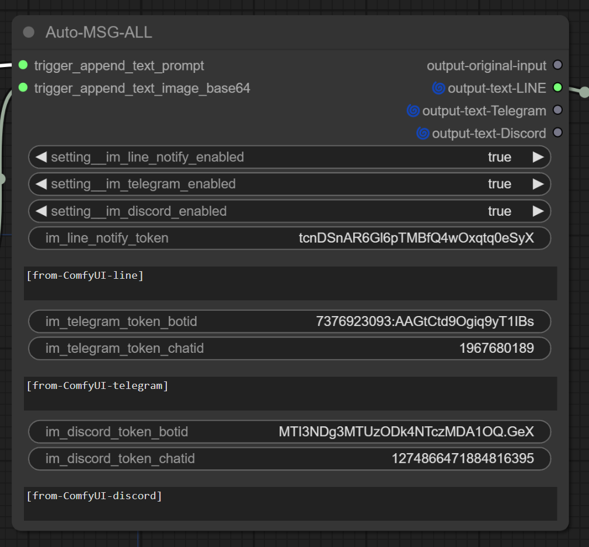
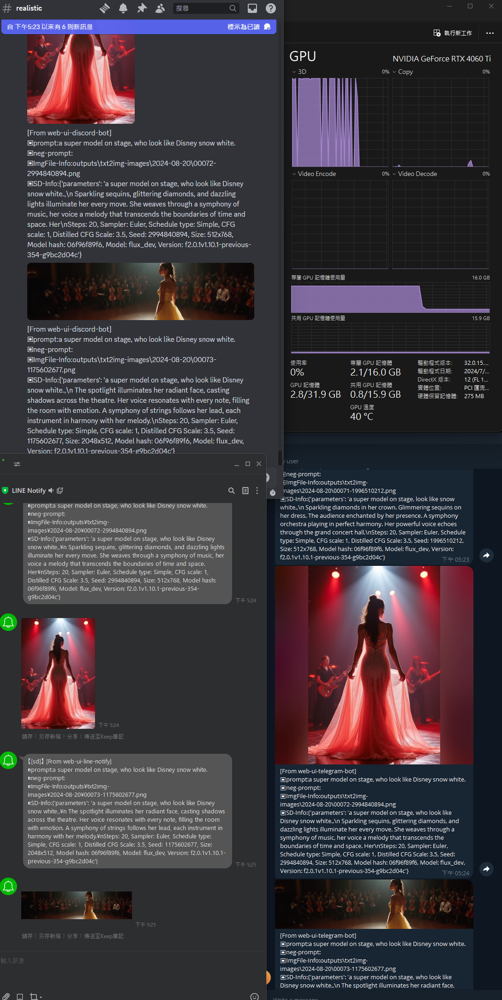
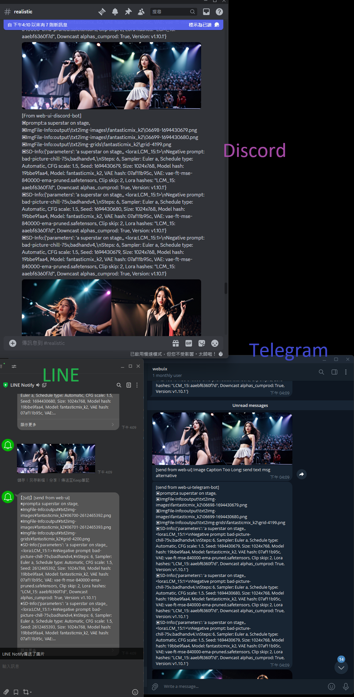

### Quick Links

* Auto prompt by LLM and LLM-Vision (Trigger more details out inside model) 
    * SD-WEB-UI: https://github.com/xlinx/sd-webui-decadetw-auto-prompt-llm
    * ComfyUI:   https://github.com/xlinx/ComfyUI-decadetw-auto-prompt-llm
* Auto msg to ur mobile  (LINE | Telegram | Discord)
  * SD-WEB-UI :https://github.com/xlinx/sd-webui-decadetw-auto-messaging-realtime
  * ComfyUI:  https://github.com/xlinx/ComfyUI-decadetw-auto-messaging-realtime

# SD-WEB-UI | ComfyUI | decadetw-Auto-Messaging-realtime

  
  
   
  

* SD-WEB-UI | ComfyUI | extension | cust-nodes
* Support 
  * 🟢 LINE-Notify  [update202407]
  * 🟢 Telegram-bot [update202407]
  * 🟢 Discord-bot  [update20240820]
* Messaging by 🟢time | 🟢result | 🟠states
  * 🟢 every 10|60|120 sec
  * 🟢 each result image generated (finding how get image path ing...)
  * 🟠 temperature state too high (considering use py-lib or not )
* Messaging to you or group
  * 🟢 image result, 
  * 🟢 prompt, 
  * 🟠 web-ui setting, 
  * 🟠 PC state (like: CPU, GPU temperature) (studying... )
    * https://github.com/w-e-w/stable-diffusion-webui-GPU-temperature-protection

## Motivation
* Mobile phone wallpaper.
  * change mobile wallpaper ever 5sec....
* an architect like: architect, cloth designer, art-worker.
  * IF you are looking for idea 🍥 from image
  * just slide ur phone IM msg
* When u outdoor, receive SD-web-ui State.
  * [Receive] Image
  * 🟢 SD-image-generated
  * 🔴 ~~PC screenshot~~ (security issue, if u know what u r doing, u can enable it inside code by uself) 
    * ~~u can put the windows-build system monitor beside for screenshot capture~~
  * [Receive] Text
  * 🟢 SD-Prompt
  * 🟠 PC-State-temperature (working...)
    * Nvidia| AMD | temperature
  
* 🦥 Just look IM app to check result from web-ui
* [Rx] 📲 Monitor ur Web-ui when u eating, GYM, working
  * 🟢 image, info-text, info-temperature
* [Tx] Control ur Web-ui when u eating, GYM, working (not yet)
  * 🟠 type message as command to stop gen-forever
<table style="border-width:0px">
 <tr>
    <td><b style="font-size:30px">1. LINE-Notify</b></td>
    <td><b style="font-size:30px">2. Telegram-Bot</b></td>
    <td><b style="font-size:30px">3. Discord-Bot</b></td>
 </tr>
<tr>
    <td></td>
    <td></td>
    <td></td>
 </tr>
</table>
<table style="border-width:0px" >
<tr>
    <td colspan="2"><b style="font-size:30px">3. Monitor result on Mobile (prompt, image, temperature)</b></td>
</tr>
<tr >
    <td colspan="2"></td>
    
 </tr>
<tr>
    <td colspan="2"><b style="font-size:30px">4. Auto Msg Realtime Interface | SD-WEB-UI & ComfyUI</b></td>
 </tr>
<tr >
    <td colspan="1"></td>
    <td colspan="1"></td>

</tr>
<tr>
    <td colspan="2"><b style="font-size:30px">5. working preview. </b></td>
<tr>
    <td colspan="2"><b style="font-size:16px">[🟢] stable-diffusion-webui-AUTOMATIC1111</b></td>
</tr>
<tr>
    <td colspan="2"><b style="font-size:16px">[🟢] stable-diffusion-webui-forge</b></td>
</tr>
<tr>
    <td colspan="2"><b style="font-size:16px">[🟢] ComfyUI </b></td>
</tr>
<tr>
    <td colspan="2"><b style="font-size:30px">6. Send Multi-Info perview.</b></td>
</tr>
<tr>
    <td colspan="1">
        
    </td>
    <td colspan="1">
        
    </td>
 </tr>
</table>

---

# Setup guide

## Message Action type 
* Rx-only⬇️ and Rx+TX🔃
* Only send from sd-web-ui to mobile(easy 10mins)
  * its useful enough for most case.
  * Line Notify https://notify-bot.line.me/
  * Telegram bot https://t.me/botfather
* ~~Send command from mobile to sd-web-ui (u need a cloud server for webhook)~~
  * Line Bot Messaging API https://developers.line.biz/en/services/messaging-api/
  * send simple command to control web-ui
    * star/stop forever generate
    * add/remove prompt
    * ...u tell me
  * [update] security issue; this feature paused.

## Installtion  

#### Preparing
* Line-Notify: ❓[access-token] ~5min
* ~~Line-Bot-Messaging-API:~~ ❓[API access-token-ID] ❓[cloud-server] ~60min
* Telegram-bot: ❓[bot-token] ❓[chat-id] ~10min
* Discord: ❓[User]/❓[Server|Guild]/❓[Message] ID ~15min

#### LINE
  * ⬇️LINE Notify (basic usage, receive from web-ui)
    * You need get Token, 
    * then add LINENotify to where u want recive place(can be a group or just u)
    * 1. https://notify-bot.line.me/
    * 2. free for 1000 request /per token
    * 3. ever account can have 100 tokens max 
    * 4. limit info https://notify-bot.line.me/doc/en/
  * LINE bot messaging-api (in advance, u can send message control web-ui)
    * https://developers.line.biz/zh-hant/services/messaging-api/
#### Telegram
  * Telegram 
    * You need get [**_`BotToken`_**] & [**_`ChatId`_**]
      1. https://t.me/botfather
      2. type /newbot 
      3. bot name: webuix
      4. bot username("end with _bot"): webuix_bot
      5. okay, u got [**_`BotToken`_**]
      6. add ur new bot as friend: goto https://t.me/webuix_bot
      7. get [**_`ChatID`_**]: https://api.telegram.org/botXXXXXXXXXXXXXXX/getUpdates
      8. find [**_`ChatID`_**] in json file=> ex: 1967680189
   * detail manual: https://core.telegram.org/bots/tutorial#getting-ready
   * get BotToken
     * add botfather inside ur telgram
     * type "/newbot"
     * type "XXXXXXXX_bot"
     * then, u will get botToken
     * then add this bot as ur friend
   * get ChatId
     * replace YOUR_BOT_TOKEN
       * https://api.telegram.org/botYOUR_BOT_TOKEN/getUpdates
   * WhatsApp
     * seems only for business
     * https://business.whatsapp.com/products/business-platform
   * IFTTT (share what's funny how u interactive with web-ui)
     * https://ifttt.com/line
     * https://ifttt.com/explore
#### Discord
  * [TX & RX] ~~Send Cmd from Discord to sd-web-ui~~ security issue. 
  * [TX-only]Send sd-web-ui to Discord. we need 
    * [Channel-ID] 
    * [Bot-Token] 
    * [Invite-Bot-into-Channel]
    
    ##### [Channel-ID]
    * Create a channel on ur discord
      * In The Discord application go to Settings > Appearance > Check developer mode. 
      * Right click channel name and copy the channel ID (Copy ID).
    ##### [Bot-Token]
    * goto Discord Developer Portal. https://discord.com/developers/applications
    * Create App on discord. 
    * Add a Bot. Check [Message Content Intent] Save Change. 
    * View [Token]. copy it into extension.
    ##### [Invite-Bot-into-Channel]
    * In App page left side menu [OAuth2]->[SCOPES]->checkbox [bot]->permissions [send message] get bot URL.
    * run url. Add bot to channel
      * bot URL ex: https://discord.com/oauth2/authorize?client_id=xxxxxxxxxxxx&permissions=2048&integration_type=0&scope=bot
      * then u should see bot inside channel in user list.(前往「OAuth2」， 在「SCOPES」中點選 bot，下方連接就是機器人邀請連結，就可以將機器人邀請進去你自己的群)
  
## Other sd-extension auto series!
* sd-webui-decadetw-auto-messaging-realtime
  * send sd-image result to your IM on mobile phone
  * LINE, Telegram,
  * https://github.com/xlinx/sd-webui-decadetw-auto-messaging-realtime
* sd-webui-decadetw-auto-prompt-llm
  * render AI by AI
  * call LLM-Text-Vision for SD-prompt
  * https://github.com/xlinx/sd-webui-decadetw-auto-prompt-llm

## Buy me a Coca cola ☕

https://buymeacoffee.com/xxoooxx

## Colophon

Made for fun. I hope if brings you great joy, and perfect hair forever. Contact me with questions and comments, but not threats, please. And feel free to contribute! Pull requests and ideas in Discussions or Issues will be taken quite seriously!
--- https://decade.tw

