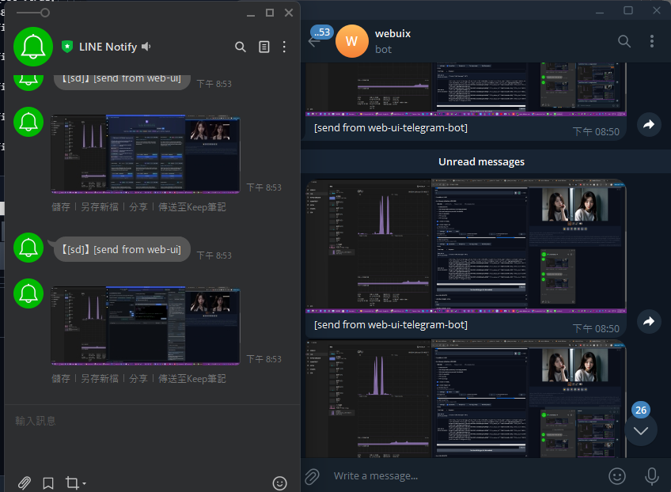
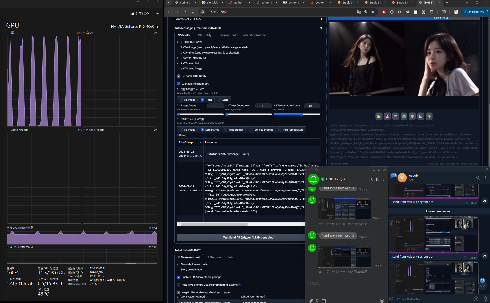

# sd-webui-decadetw-Auto-Messaging-realtime
* Automatic1111 extension
* Messaging by time | result | states
  * every 10|60|120 sec
  * each result image generated
  * temperature state too high
* Messaging to you or group
  * image result, 
  * prompt, 
  * web-ui setting, 
  * PC state (like: CPU, GPU temperature)
    * https://github.com/w-e-w/stable-diffusion-webui-GPU-temperature-protection

## Motivation

* When u outdoor, receive SD-web-ui State.
  * [Receive] Image
    * SD-image-generated
    * PC screenshot
      * u can put the windows-build system monitor beside for screenshot capture
  * [Receive] Text
    * SD-Prompt
    * PC-State-temperature (working...)
      * Nvidia card temperature
      * AMD card temperature
      * CPU temperature
  * [Receive] SD-Running-PC-Screenshot
  
* Just look IM app to check result from web-ui
* [Rx] Monitor ur Web-ui when u eating, GYM, working
  * image, info-text, info-temperature
* [Tx] Control ur Web-ui when u eating, GYM, working (not yet)
  * type message as command to stop gen-forever
<table style="border-width:0px" >
 <tr>
    <td><b style="font-size:30px">1. LINE-Notify</b></td>
    <td><b style="font-size:30px">2. TelegramBot</b></td>
 </tr>
<tr>
    <td></td>
    <td></td>
 </tr>
<tr>
    <td colspan="2"><b style="font-size:30px">3. Monitor SD-web-ui on Phone</b></td>
 </tr>
<tr >
    <td colspan="2"></td>
 </tr>
<tr>
    <td colspan="2"><b style="font-size:30px">4. Monitor w/GPU on Phone</b></td>
 </tr>
<tr >
    <td colspan="2"></td>
 </tr>
<tr>
    <td colspan="2"><b style="font-size:30px">5. Auto mMessaging UI</b></td>
 </tr>
<tr >
    <td colspan="2"></td>
 </tr>
</table>

---

## Installtion

* You need get Messaging access token first. 
  * LINE Notify (basic usage, receive from web-ui)
    * You need get Token, 
    * then add LINENotify to where u want recive place(can be a group or just u)
    * 1. https://notify-bot.line.me/
    * 2. free for 1000 request /per token
    * 3. ever account can have 100 tokens max 
    * 4. limit info https://notify-bot.line.me/doc/en/
  * LINE bot messaging-api (in advance, u can send message control web-ui)
    * https://developers.line.biz/zh-hant/services/messaging-api/
  * Telegram 
    * You need get [**_`BotToken`_**] & [**_`ChatId`_**]
      1. https://t.me/botfather
      2. type /newbot 
      3. bot name: webuix
      4. bot username("end with _bot"): webuix_bot
      5. okay, u got [**_`BotToken`_**]
      6. add ur new bot as friend: goto https://t.me/webuix_bot
      7. get [**_`ChatID`_**]: https://api.telegram.org/botXXXXXXXXXXXXXXX/getUpdates
      8. find [**_`ChatID`_**] in json file=> ex: 1967680189
  
   * detail manual: https://core.telegram.org/bots/tutorial#getting-ready
      
   * get BotToken
     * add botfather inside ur telgram
     * type "/newbot"
     * type "XXXXXXXX_bot"
     * then, u will get botToken
     * then add this bot as ur friend
   * get ChatId
     * replace YOUR_BOT_TOKEN
       * https://api.telegram.org/botYOUR_BOT_TOKEN/getUpdates
   * WhatsApp
     * seems only for business
     * https://business.whatsapp.com/products/business-platform
   * IFTTT (share what's funny how u interactive with web-ui)
     * https://ifttt.com/line
     * https://ifttt.com/explore

  

## Colophon

Made for fun. I hope if brings you great joy, and perfect hair forever. Contact me with questions and comments, but not threats, please. And feel free to contribute! Pull requests and ideas in Discussions or Issues will be taken quite seriously!
--- https://decade.tw

